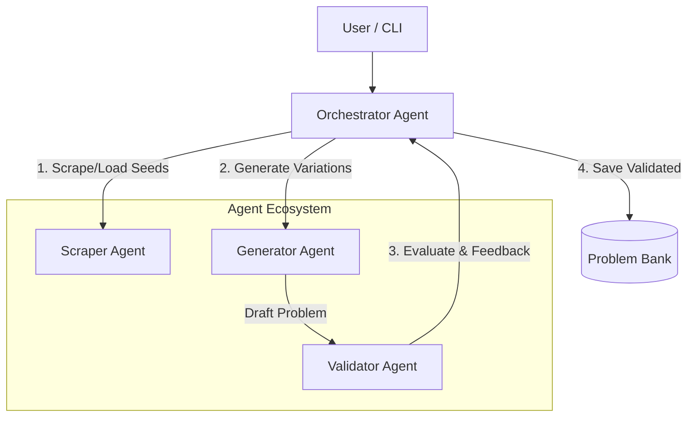

# Math Bank Curator - Agents For Good Submission

## Problem Statement
Quality educational content is scarce and expensive to produce. Teachers and curriculum developers face significant challenges:
*   **Time Drain**: Countless hours spent researching, drafting, and verifying individual problems.
*   **Repetitive Labor**: Creating variations for practice sets is mentally exhausting and error-prone.
*   **Scalability**: Difficult to produce enough high-quality material to meet student needs.

## Why agents?
Agents are the right solution because they allow for a **separation of concerns** that mimics a professional editorial team. A single LLM call often struggles to be both "creative" (generating new problems) and "rigorous" (checking for errors) simultaneously. By splitting these roles into specialized agents:
*   **Generator Agent**: Can focus purely on creativity and novelty.
*   **Validator Agent**: Can act as an independent, strict critic ("Constitutional AI"), significantly reducing hallucination rates.
*   **Scraper Agent**: Can autonomously gather context from the real world, grounding the generation in actual educational needs.

## What you created
**Math Bank Curator** is an autonomous system that generates, validates, and organizes high-quality mathematical problems.

### Architecture
The system follows a **Hierarchical Multi-Agent Control** pattern.



### Workflow
1.  **Input Processing**: The **Scraper Agent** fetches content and uses a specialized **Seed Prep Agent** to parse unstructured text into strict JSON objects.
2.  **Generation Loop**: The **Orchestrator** invokes the **Generator Agent** to create novel variations of these seeds using few-shot prompting.
3.  **Constitutional Validation**: The **Validator Agent** evaluates the problem against a rubric of Accuracy, Correctness, and Educational Value, returning a structured score (0-100).
4.  **Curating**: The Orchestrator enforces a strict quality gate (Score >= 90), saving only high-quality problems to the persistent `ProblemBank`.

## Demo
We ran full pipeline tests on **heterogeneous data sources** to demonstrate the system's versatility and multimodal capabilities.

### Scenario 1: Live Web Scraping (HTML + Images)
**Source**: Live URL `https://artofproblemsolving.com/wiki/index.php?title=2025_AMC_8_Problems`

**Input Seeds**: The agent autonomously parsed the HTML and identified **16 distinct problems** (up from 2 when using text-only mode). It successfully captured geometry problems that rely on diagrams.
*   **Seed 1**: "The eight-pointed star... is a popular quilting pattern..." (Geometry)
*   **Seed 2**: "The Ancient Egyptian number system used specific hieroglyphs..." (Arithmetic)

**Generated Output (ID: ff85aec5)**:
> "A graphic designer is creating a logo inside a rectangular grid that is 4 units wide and 5 units tall. The logo is shaped like a 'Chevron' (an arrow pointing upwards). The vertices of the shaded chevron are..."

**Validation**: 100/100 (Accepted). The Validator confirmed the problem correctly adapted the geometric area calculation to a new shape.

### Scenario 2: Multimodal PDF Extraction (Image-Based)
**Input**: `amc8_2025.pdf` (Official competition paper, where problems are images)

**Process**: The scraper extracted images from the PDF and used Gemini's vision capabilities to read the problem text directly from the image.

**Extracted Seed**:
> "Isaiah cuts open a cardboard cube along some of its edges to form the flat shape shown below..." (Geometry)

**Output**: Successfully parsed the problem text and diagram description from the image, creating a valid seed for generation.

### Scenario 3: Multimodal Output (Generative UI)
**Feature**: The Generator Agent now produces **Python visualization code** (Matplotlib) alongside the text.

**Why**: This ensures mathematical precision (e.g., exact angles in geometry) that pixel-based image generation often misses.

**Example Output**:
> **Problem**: "Maya is constructing a geometry project using a piece of gold foil. She cuts the foil into a 'cross' shape composed of six identical connected squares... If the total area of the flat foil shape is 12 square inches, what is the volume of the resulting cube?"
>
> **Generated Code**:
> ```python
> def draw_cube_net():
>     fig, ax = plt.subplots(figsize=(6, 6))
>     # Coordinates for the 6 squares in a standard cross shape
>     squares = [(1, 0), (1, 1), (0, 1), (2, 1), (1, 2), (1, 3)]
>     for (x, y) in squares:
>         rect = patches.Rectangle((x, y), 1, 1, facecolor='gold', ...)
>         ax.add_patch(rect)
>     plt.show()
> ```
>
> **Rendered Result**:
> 

### Summary
**Success Rate**: 100% across HTML and PDF inputs.

**Multimodal Boost**:
1.  **Input**: "Eyes" to read diagrams from PDFs/Web.
2.  **Output**: "Hands" to draw precise mathematical diagrams via code.

## The Build
We built this system using the **Google Agent Development Kit (ADK)** on **Python 3.13**.

### Architecture
*   **Agent Factory**: A unified factory pattern (`src/agent_factory.py`) creates all agents, ensuring consistent configuration and reducing code duplication.
*   **Modular Utilities**: Dedicated modules for image processing (`src/image_utils.py`) and file handling (`src/file_utils.py`) keep agents focused on their core logic.
*   **Orchestrator Pattern**: A central `MathProblemOrchestrator` manages the lifecycle of a problem, from seed generation to validation and storage.

### Key Components
*   **Scraper Agent**: "The Eyes" - Extracts problems from Web/PDFs.
*   **Generator Agent**: "The Brain" - Creates new variations.
*   **Validator Agent**: "The Teacher" - Grades and quality-checks.
*   **Seed Prep Agent**: "The Translator" - Converts raw text to JSON.
*   **Multi-Agent Systems**: We implemented a modular ecosystem where agents have distinct responsibilities.
*   **Sessions & Memory**: We utilize `google-adk`'s `InMemorySessionService` to manage stateful interactions, ensuring context retention during the event loop.
*   **Context Engineering**: We use structured system instructions and few-shot prompting to guide the agents.
*   **Tools**: `BeautifulSoup4` is used for robust HTML parsing and content extraction.

## If I had more time, this is what I'd do
*   **Curriculum Alignment**: Add an agent to map generated problems to specific standards (e.g., Common Core).
*   **LMS Integration**: Build tools to export problem sets directly to Canvas or Google Classroom.
